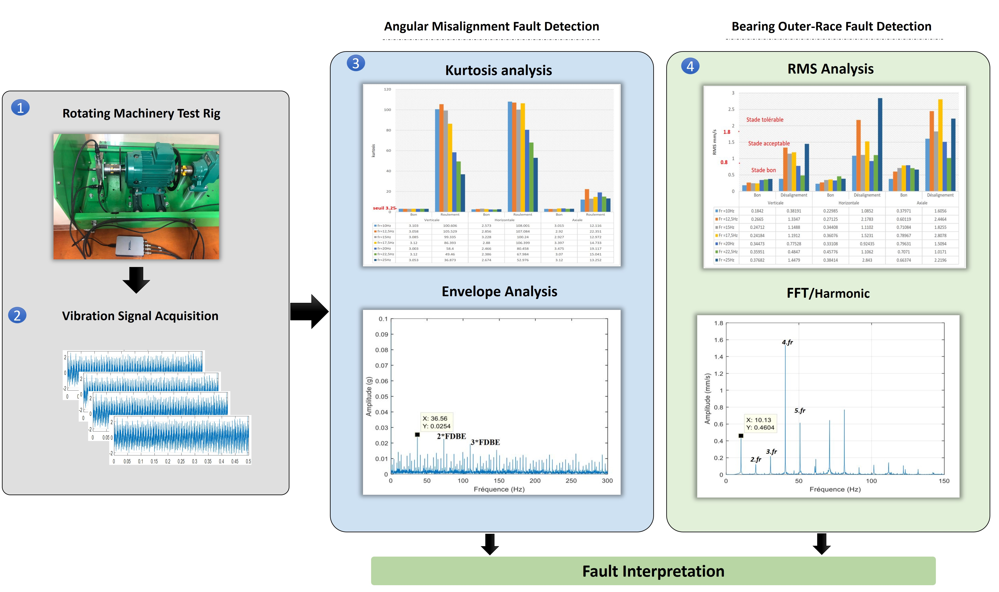
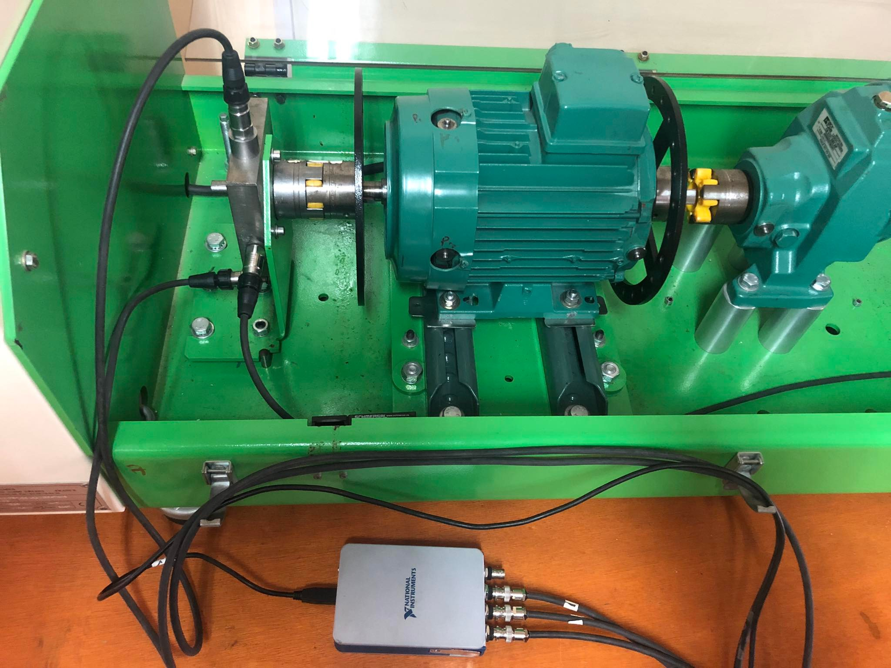

# Experimental-Vibration-Fault-Diagnosis-Using-Statistical-and-Spectral-Analysis

This repository presents a comprehensive experimental study focused on the condition monitoring, fault detection, and isolation of mechanical anomalies in rotating machinery. The project leverages a combination of time-domain statistical indicators and frequency-domain spectral processing to isolate low-frequency structural issues from high-frequency component defects.

---

## 1. Project Overview

The objective of this work is to systematically implement predictive maintenance methodologies to identify critical mechanical faults. The study focuses on evaluating the diagnostic efficacy of various physical measurement domains—**displacement**, **velocity**, and **acceleration**—under different fault conditions across multiple operational metrics. 

By analyzing multi-axial vibration signatures, this project successfully differentiates between:
* **Low-Frequency Phenomena:** Axisymmetric structural anomalies, specifically **angular shaft misalignment**.
* **High-Frequency Phenomena:** Transient mechanical shocks, specifically **bearing outer-race localized defects**.

---

## 2. Experimental Setup

The data utilizing these diagnostic frameworks was acquired from a dedicated laboratory machinery test rig designed to simulate real-world industrial fault conditions.

* **Machinery Test Rig:** An integrated mechanical simulator consisting of an electric motor, a mechanical speed reducer, bearings, and a fluid pump.
* **Speed Regulation:** Driven via a Variable Frequency Drive (VFD) to simulate steady-state operational speeds up to **1500 RPM (25 Hz)**.
* **Fault Injection Methodology:**
* *Angular Misalignment:* Generated deterministically by inducing a precision controlled micro-slip at the electric motor's support base.
* *Bearing Defects:* Comparative testing performed using an identical baseline control group: a pristine, brand-new bearing vs. an identical element modified with a localized **outer-race defect**.
* **Sensor & Data Acquisition (DAQ) Hardware:**
* **Transducer:** Model 603C01 Platinum Low-Cost Industrial Accelerometer.
* **Sensitivity:** $100\text{ mV/g}$.
* **Measurement Axis:** Tri-axial mounting blocks capturing orthogonal data paths simultaneously (**Vertical, Horizontal, and Axial**).
* **Software Stack:** High-speed streaming interface configured natively in **National Instruments LabVIEW**, with downstream computational signal processing executed in **MATLAB**.

--- 

* ## 3. Mathematical & Theoretical Context
To map raw time-series measurements into distinct diagnostic trends, a robust analytical framework spanning time, frequency, and demodulated envelope boundaries was established.

### A. Time-Domain Statistical Metrics
Scalar time-domain features serve as computationally lightweight "early-warning" alarms to detect the emergence of a structural transition.

* **Root Mean Square (RMS):** Tracks the global energy content of the destructive vibration profile.
 $$X_{\text{RMS}} = \sqrt{\frac{1}{N} \sum_{n=1}^{N} x_n^2}$$
* **Kurtosis:** Measures the relative spikiness/tailedness of the signal profile. A healthy sinusoidal baseline yields a value around $3.0$. Micro-shocks from rolling elements drastically increase this metric.
 $$\text{Kurtosis} = \frac{\frac{1}{N}\sum_{n=1}^{N}(x_n - \bar{x})^4}{\left(\frac{1}{N}\sum_{n=1}^{N}(x_n - \bar{x})^2\right)^2}$$
* **Crest Factor:** Evaluates the ratio of extreme impact peaks to the overall steady energy profile, serving as a primary indicator for localized impact tracking.
 $$\text{Crest Factor} = \frac{x_{\text{peak}}}{X_{\text{RMS}}}$$
### B. Spectral & Envelope Transformation
While time-domain features alert to the *existence* of a defect, frequency-domain transformations reveal the structural *root cause*.
* **Fast Fourier Transform (FFT):** Converts discrete time series $x_n$ into discrete spectral arrays $X_k$ to expose cyclic operational anomalies.
 $$X_k = \sum_{n=0}^{N-1} x_n e^{-j \frac{2\pi}{N} kn}$$
* **Hilbert Transform (Envelope Spectrum):** Extracts low-amplitude, high-frequency impact cycles masked by heavy structural noise. By applying an analytical filter $z(t) = x(t) + j\hat{x}(t)$ and mapping its absolute magnitude, high-frequency carrier content is demodulated, exposing the pure Ball Pass Frequency Outer-Race ($\text{BPFO}$) components.
  
 --- 
## 4. Results & Methodological Analysis ### 
A. Structural Fault Mapping (Misalignment) Low-frequency structural faults introduce smooth, continuous geometric oscillations.
The evaluation verified that tracking this defect requires changing focus based on the physical parameter analyzed: 
* **Displacement Domains:** Highly reactive to severe structural shifts. Misalignment patterns are explicitly localized and isolated in the **Axial direction**, showing strong dominance at the fundamental running speed harmonic ($1\times f_r$).
* **Velocity Domains:** Shows extreme spectral sensitivity at elevated multiples. Misalignment shows up clearly via prominent higher-order running harmonics—most noticeably at the **$3\times f_r$ and $4\times f_r$ energy peaks**.
### B. Component Defect Mapping (Bearing Outer-Race)
In contrast to misalignment, localized structural bearing flaws generate sharp, transient, micro-second impacts every time a rolling element passes over the outer-race crack.
* **Acceleration Domain:** Because micro-impacts radiate minuscule energy amounts across highly elastic structural channels, they are completely invisible within low-frequency displacement or velocity profiles. They must be tracked within the high-frequency **Acceleration domain**, showing the most optimal signal-to-noise ratio along the **Horizontal Radial axis**.
* **Statistical Demodulation:** While global energy metrics ($\text{RMS}$) remain relatively unchanged in early fault stages, **Kurtosis** spikes past its healthy $3.25$ threshold boundary. Following demodulation, the **Envelope Spectrum** resolves explicit, crisp harmonic lines matching the exact theoretical $\text{BPFO}$ calculation lines.

--- 
## 5. Detailed Engineering Conclusions
This experimental investigation yields clear, prescriptive rules regarding sensor placement, metric selection, and parameter domains for industrial machinery condition monitoring: 
1. **Domain Isolation is Critical:** Low-frequency geometric anomalies (like angular misalignment) must be monitored via **Displacement and Velocity** tracking. High-frequency localized mechanical shocks (like bearing defects) are fundamentally invisible in those ranges and must be analyzed using **Acceleration**.
2. **Directional Dependency Matters:** * **Angular Misalignment** is a directional structural anomaly that shows its clearest diagnostic traits almost exclusively along the **Axial plane**.
* **Bearing Outer-Race Defects** transfer kinetic shock impacts outward through the housing walls, making them easiest to diagnose along the **Horizontal Radial plane**.
4. **Detection vs. Isolation:** Time-domain statistical indicators (such as Kurtosis surpassing a value of 3) act as exceptional, computationally lightweight triggers for **Fault Detection**. However, precise **Fault Isolation** requires frequency-domain and envelope demodulation tools to accurately confirm the mechanical source.
---

## 📁 Experimental Figures & Data Directory

To preserve the readability of this case study, raw visual plots and asset files are maintained directly within the repository's file structure. For a granular analysis of specific operating conditions, please navigate to the `/images` directory, which contains the following verified diagnostic figures:

* **Experimental Setup & Framework:**
  * `test_rig.jpg` — Structural blueprint and component layout of the physical machinery test rig.
  * `workflow.jpg` — Detailed visual breakdown of the multi-stage diagnostic process.

* **Structural Low-Frequency Diagnostics (Misalignment & Unbalance):**
  * `rms_displacement.JPG` & `rms_velocity.jpg` — Multi-axial scalar trend evaluations tracking overall energy shifts.
  * `angular_alignment_spectrum_10hz.jpg` — Discrete FFT spectrum capturing low-speed running harmonics ($10\text{ Hz}$).
  * `angular_alignment_spectrum_25hz.jpg` — Discrete FFT spectrum verifying tracking stability at maximum operational speed ($25\text{ Hz}$ / $1500\text{ RPM}$).

* **Component High-Frequency Diagnostics (Bearing Outer-Race Defects):**
  * `kurtosis_histogram.jpg` & `crest_factor_histogram.jpg` — Statistical time-domain histograms proving early-stage impulse detection.
  * `envelope_spectrum_10hz.jpg` & `envelope_spectrum_25hz.jpg` — Demodulated amplitude spectrums successfully isolating specific rolling-element defect frequency lines ($BPFO$).

## 🔒 Institutional Data Privacy Notice

> ⚠️ **Data Confidentiality Notice:** *The raw sensor time-series datasets used throughout this research are bound by institutional confidentiality agreements governing the laboratory facilities, university assets, and advisor provisions. To show compliance with intellectual property boundaries while validating engineering competency, this repository contains the core processing scripts, theoretical frameworks, and verified diagnostic figures.*

